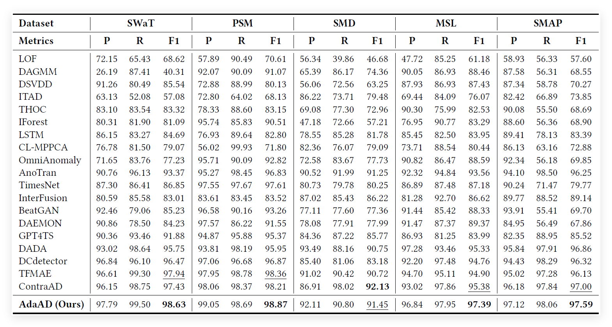
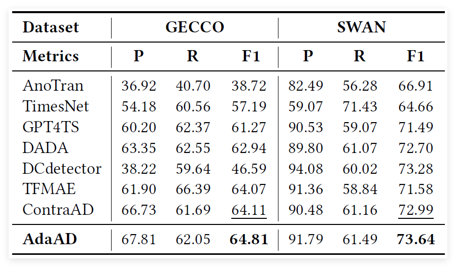
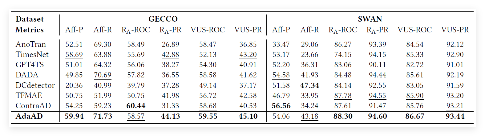

# AdaAD

## Adaptive Contrastive Learning with Dual-Level Augmentation and Cross-View Denoising for Unsupervised Anomaly Detection in Time Series
 
[Paper PDF]()
---

## Overview

AdaAD introduces a **learnable augment-then-denoise paradigm** for constructing informative and complementary time-series views.

- **Overall:** AdaAD learns anomaly-sensitive temporal representations by contrasting two adaptively generated and cross-view-denoised views of the same input sequence.

- **Dual-Level Augmentation:** A value-level augmentation (VLA) preserves global temporal structure while introducing value variations, whereas a structure-level augmentation (SLA) perturbs global dependencies while retaining local continuity.

- **Learnable Temporal Permutation:** A differentiable Sinkhorn-based permutation module adaptively reorganizes temporal dependencies for each input sequence. Random permutation initialization helps avoid trivial collapse to the original ordering.

- **Cross-View Denoising:** Mutual prediction between VLA and SLA suppresses view-specific augmentation noise while preserving shared temporal semantics.

- **Adaptive Contrastive Learning:** An asymmetric stop-gradient objective promotes representation consistency for normal patterns and discrepancy for anomalous patterns.
---

## Architecture

AdaAD consists of three main modules:

1. **Dual-Level Augmentation**
   - Value-level augmentation (VLA)
   - Structure-level augmentation (SLA)
   - Learnable temporal permutation based on Sinkhorn normalization

2. **Cross-View Denoising**
   - VLA-to-SLA prediction
   - SLA-to-VLA prediction
   - Shared denoising network

3. **Adaptive Contrastive Learning**
   - Multi-head temporal dependency representations
   - Symmetric row-wise KL divergence
   - Asymmetric stop-gradient optimization
   - Point-wise anomaly scoring from cross-view representation discrepancy

||
|:--:| 
| *Figure 1: Overall architecture of the AdaAD.* |

| | 
|:--:|
| Figure 2: Illustration of learnable permutation.|


---

## Main Results

The following table reports Precision, Recall, and F1-score from the paper.

||
|:--:| 
| *Overall comparison on five standard benchmark datasets. Best results are in bold and the second ones are underlined.* |

||
|:--:| 
| *Comparison on NIPS-TS datasets. Best results are in bold and the second ones are underlined.* |

||
|:--:| 
| *Comparison on NIPS-TS datasets under diverse metrics. Best results are in bold and the second ones are underlined.* |


---
## Code Description

```text
AdaAD/
├── data_factory/           # The datasets preprocessing folder and files.
├── dataset/                # The dataset folder.
├── checkpoints/            # Directory for saving trained model checkpoints. The pretrained checkpoints included in this repository can be used directly for testing.
├── metrics/                # The evaluation metrics code folder, which includes VUC, affiliation precision/recall pair, and other common metrics.
│── AdaAD.py                # AdaAD model files. The details are presented in the paper.
│── attention.py            
│── augmentations.py        
├── result/                 # The results and train processing logs are saved in this folder.
├── scripts/                # The experiments scripts. 
├── utils/                  # The functions for data processing.
├── img/                    # Images in readme.md.
├── main.py                 # The main python file. 
├── solver.py               # The training and testing processing file.
└── requirements.txt        # Python dependencies required to run AdaAD.
```

<!-- Add the public download URL after uploading the processed datasets. -->
**Dataset download:** `<DATASET_DOWNLOAD_URL>`

---

## Get Start

1. Python ==3.12.2, PyTorch ==2.5.1,install packages in requirements.txt.
2. Unzip data in the dataset folder. **Dataset download:** `<DATASET_DOWNLOAD_URL>`
3. Experiment scripts should be placed under `./scripts/`. .Main experiments can be reproduced with:

```bash
bash ./scripts/SWaT.sh
bash ./scripts/PSM.sh
bash ./scripts/SMD.sh
bash ./scripts/MSL.sh
bash ./scripts/SMAP.sh
bash ./scripts/NIPS_TS_GECCO.sh
bash ./scripts/NIPS_TS_SWAN.sh
```
---

